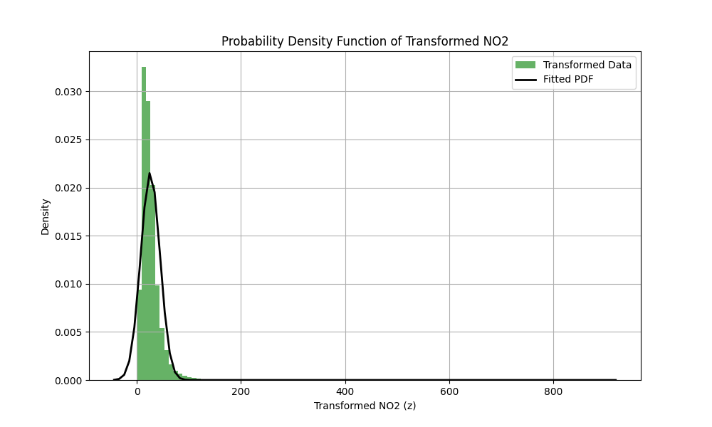

# Advanced Maths Assignment - Parameter Estimation

This repository contains the solution for the Advanced Maths assignment, focused on processing the `no2` feature from an air quality dataset and estimating parameters for a specific probability density function.

## 📋 Methodology

The goal is to learn the parameters of a specified probability density function (PDF) after applying a non-linear transformation to the data.

### 1. Data Transformation
The original feature $x$ (Concentration of NO2) is transformed into $z$ using the following equation:

$$ z = T_r(x) = x + a_r \sin(b_r x) $$

The coefficients $a_r$ and $b_r$ are determined by the University Roll Number **102303684**:
- $r = 102303684$
- $a_r = 0.05 \times (r \pmod 7) = 0.05 \times 0 = 0.0$
- $b_r = 0.3 \times ((r \pmod 5) + 1) = 0.3 \times (4 + 1) = 1.5$

Thus, for this specific roll number, the transformation simplifies to:
$$ z = x $$

### 2. Probability Density Function (PDF) Estimation
We fit the transformed data $z$ to the following PDF:

$$ \hat{p}(z) = c \cdot e^{-\lambda(z-\mu)^2} $$

This formulation aligns with the Gaussian estimation where:
- $\mu$ is the mean of the data.
- $\lambda = \frac{1}{2\sigma^2}$
- $c = \frac{1}{\sigma\sqrt{2\pi}}$

We used Maximum Likelihood Estimation (MLE) via `scipy.stats.norm.fit` to find the mean ($\mu$) and standard deviation ($\sigma$) of the transformed data.

## 📊 Results

### Estimated Parameters

| Parameter | Symbol | Value |
| :--- | :---: | :--- |
| **Mean** | $\mu$ | **25.8096** |
| **Lambda** | $\lambda$ | **0.001460** |
| **Constant** | $c$ | **0.021561** |

### Result Graph
The graph below shows the histogram of the transformed data ($z$) overlaid with the fitted Probability Density Function.

## 📁 Files
- `assignment_solution.ipynb`: Jupyter Notebook containing the code and step-by-step application.
- `solve_assignment.py`: Python script for quick execution.
- `result_graph.png`: Generated graph of the PDF.
- `data 2.csv`: Dataset used.

